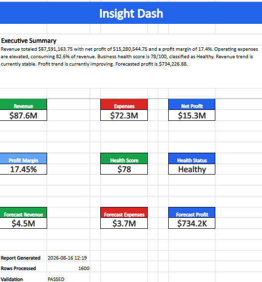

# Insight Dash: Executive Financial Dashboard (v1.0)

An end-to-end Python data pipeline that automates corporate financial reporting. The system ingests raw data from Kaggle, executes KPI calculations, runs predictive forecasting, and exports a presentation-ready Excel dashboard complete with embedded corporate visualizations.

## 📈 Core Engine Performance & Output Metrics

When executed, the analytics pipeline parses the parsed dataset, runs automated data validations, and generates high-fidelity corporate financial reports:

### ⚙️ Operational Throughput
* **Records Processed:** 1,600 historical multi-attribute line items
* **Validation Status:** PASSED (automated structural integrity audit check)

### 📊 Calculated Financial KPIs
* **Total Ingested Revenue:** $87,591,163.75
* **Total Operating Expenses:** $72,310,619.00
* **Consolidated Net Profit:** $15,280,544.75
* **Calculated Profit Margin:** 17.45%

### 🤖 Business Intelligence Logic
* **Proprietary Business Health Score:** 78 / 100
* **Automated System Status:** "Healthy"
* **Predictive Forecasting (Next Cycle):** Revenue forecast of $4.46M against an expense ceiling of $3.73M, projecting a net gain of $734.2K.

---

## 🛠️ Tech Stack & Core Libraries
* **pandas** - Data ingestion, cleaning, and financial KPI transformations.
* **openpyxl** - Excel workbook management, structure building, and cell formatting.
* **matplotlib** - Engineering of the custom, reusable corporate chart styling system.
* **Pillow** - Image processing engine used to programmatically embed visual charts into spreadsheet layouts.

---

## 📊 Dashboard Preview
> 

---

## 🚀 Quick Start & Installation

### 1. Clone the Repository
```bash
git clone https://github.com
cd Insight-Dash
```

### 2. Install Dependencies
```bash
pip install -r requirements.txt
```

### 3. Run the Pipeline
```bash
python app.py
```
*The completed workbook will be generated instantly as an Excel export.*

---